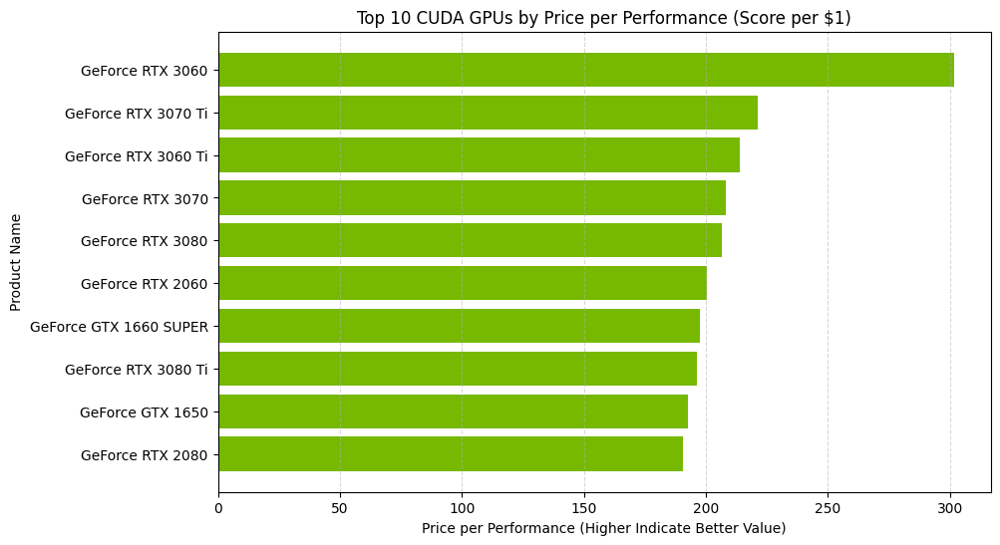

# Exploring GPU Specification, CUDA Performance and Value Proposition

     

Screengrab from https://logos.fandom.com/wiki/Nvidia_CUDA.

## Project description
 
This analysis projects aims to examine consumer level CUDA (or Compute Unified Device Architecture) supported GPUs that are capable of training A.I and Machine Learning models with the focus of comparing the performance and value proposition.
Using Python various data analysis libraries, we seek to uncover 

### File organization
_Notebooks_ 
* Geekbench_5_CUDA_Scrapper.ipynb - Scrape the CUDA Scores
* GPU_CUDA_PRICE_Analysis.ipynb - Sentiment analysis of CUDA Scores and GPU Specs

_Data files_ 
* GeekBench5_CUDA.csv - Raw CUDA Scores 
* [gpu_specs_v6.csv](https://www.kaggle.com/datasets/alanjo/graphics-card-full-specs) - Dataset containing basic GPU Specifications
* [GPU_Prices.csv](https://www.kaggle.com/datasets/alanjo/gpu-benchmarks) - Dataset containing GPU release MSRP
* [gpus_v2.csv](https://www.kaggle.com/datasets/alanjo/graphics-card-full-specs) - Dataset containing additional GPU Specifications 

  

## Analysis

### Data Collection

The CUDA scores used in this project were web scraped from [Geekbench](https://www.geekbench.com/) (a cross-platform benchmark that measures system performance). 
Additional datasets (gpu_specs_v6.cs, GPU_Prices.csv and gpus_v2.csv) were collected from Kaggle, cleaned and reformatted for this analysis by providing information on GPU specifications and pricing.

### Data Understanding and Cleaning
In the initial analysis, I begin by gaining an understanding of the data, employing methods such as .head(), .dtypes, and .shape. This comprehension of the data will guide the subsequent stages of merging and cleaning.
During the cleaning process, I employ a Python FUNCTION to convert some columns from float to int. It's important to note that specifications, such as GPU memory size, are consistently represented as integers, as they are never marketed with floating point values. In addition, I streamline the dataset by removing unnecessary columns that won't be utilized in our analysis, ensuring a more efficient process. To enhance data accuracy, I perform a swift check for NaN values, nulls, and duplicates. 

After the cleaning process, I merged GeekBench5_CUDA.csv, gpu_specs_v6.csv, GPU_Prices.csv and gpus_v2.csv together. The merged dataset included GPUs that were present in all the datasets. Merged together, the dataset included the following columns: 

Further cleaning and reformatting was done to the new merged dataset. The new dataset contains 18 columns and 162 rows. Data includes only GPUs with CUDA scores on Geekbench and available specifications and pricing.

### Data Analysis

To start the data analysis, I initiate by inspecting the manufacturers and release years of the GPUs within the dataset. Notably, the dataset exclusively comprises rows from a single manufacturer, NVIDIA. Upon close examination, we observe a gradual decrease in the number of GPUs released on Geekbench 5 from 2013 to 2018, followed by a notable decline in 2020 and 2022. These abrupt drops may be attributed to data limitations. 

**Looking at the Top 10 CUDA Scores GPU we can see RTX 3090 TI scored the highest**

**Comparing CUDA scores with Memory Size and Memory Clock**
- Below chart shows that while bigger memory size may not always lead to a higher CUDA score.
- On the other hand, higher memory clock resulted in a higher CUDA score for more GPUs. 

**Top 10 Price per Performace GPUs**
- In terms of value, the RTX 3060 had the highest price to performance value, beating out many higher tiered cards.

**How does the RTX 3060 stack up to the overall highest CUDA score GPU, the RTX 3090 TI**

- Despite its $1700 higher price tag compared to the RTX 3060, the RTX 3090 TI  a price-to-performance ratio that was only 41% of the RTX 3060.

**Average CUDA score by FAB size**

- Smaller FAB sizes tend to correlate with higher CUDA scores, potentially due to their ability to accommodate more processing units on a single die and their improved power efficiency.

**Comparing DIE size with CUDA Score**
- There is a positive trend with larger DIE size and higher CUDA score

**Comparing TDP with CUDA Score**
- TDP (Thermal Design Power) refers to the the maximum amount of heat the GPU can generate under a sustained workload.
- The chart below display a positive trend between higher TDP and CUDA scores. A higher TDP indicates that the GPU can handle more power and heat, allowing it to perform more operations over longer periods of time.

**Comparing GFLOPS with CUDA Score**

- GFLOPS or Giga Floating Point Operations per second, indicates how fast the GPU can perform calculations. 
- The chart below display a positive trend between higher GLOPS and CUDA scores. A higher GFLOPs count indicate more operations can be performed.

### Conclusion 

Based on the analysis, it appears that higher memory size and memory clock may not significantly impact CUDA performance in relation to Geekbench 5 scores. However, factors such as FAB and DIE size have demonstrated noticeable performance improvements. Having more processing units within a single die allows for more calculations to be performed, while higher GLOPS is associated with faster calculations. Moreover, TDP has also been shown to enhance CUDA scores, with GPUs featuring higher TDP values achieving better performance by managing increased heat and power consumption.